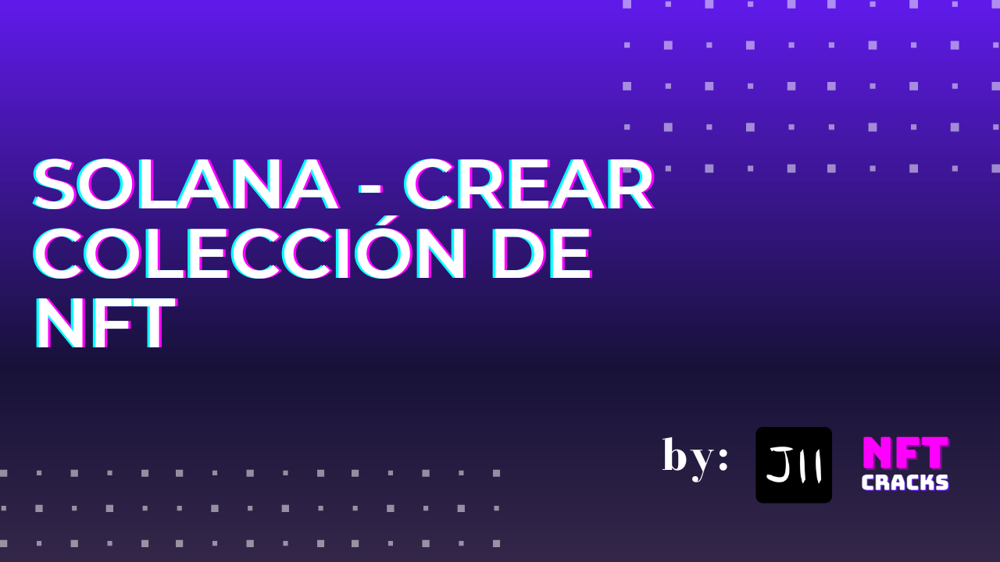

 

 

Bienvenido al repositorio principal del curso de **creación de colecciones de NFTs*.

# Table de Contendidos
- [Table de Contendidos](#table-de-contendidos)
- [Recursos de este curso](#recursos-de-este-curso)
    - [Preguntas](#preguntas)
    - [Pre-requisitos](#pre-requisitos)
    - [Windows Support](#windows-support)
    - [Mac Support](#mac-support)
    - [Otros Recursos](#otros-recursos)
- [Lesson 0: Bienvenido al curso](#lesson-0-bienvenido-al-curso)
  - [¿Para quién es el curso?](#para-quién-es-el-curso)
    - [¿Cuál es el formato del curso?](#cuál-es-el-formato-del-curso)
- [Lesson 1: [Generative Art]](#lesson-1-generative-art)
    - [Preparando tus assets Metaplex Docs](#preparando-tus-assets-metaplex-docs)

# Recursos de este curso
### Preguntas
- [Discord NFTCracks](https://discord.gg/63mu6cEfAt)
  - Pregunta and chat acerca del curso!
- [Github Discussions](https://github.com/jamescardona11/solana-nft-creation-course/discussions/)
  - Pregunta and chat acerca del curso!

### Pre-requisitos
* Online
- [Gitpod](https://www.gitpod.io/)
  
* Offline
- [Git](https://git-scm.com)
- [nodejs](https://nodejs.org/es/)
- [Github](https://github.com)
- [Vercel](https://vercel.com/)
- [VSCode](https://code.visualstudio.com) o el IDE de preferencia

### Windows Support
- [Instalar Git](https://www.youtube.com/watch?v=HGg4a9bFNIk)
  - Vea un simple video como puedes instalar Git en Windows
- [Instalar nodejs](https://www.youtube.com/watch?v=czFj5zoI5uc)
  - Vea un simple video como puedes instalar Node en Windows
- [Instalar vscode](https://www.youtube.com/watch?v=Hs49jA6FizM)

### Mac Support
- [Instalar Git](https://www.youtube.com/watch?v=nXP3aU10oOU)
  - Alternativa para instalar Git con brew
- [Instalar nodejs](https://www.youtube.com/watch?v=SwUKKCS3r3c)
  - Vea un simple video como puedes instalar Node en Mac
- [Instalar vscode](https://www.youtube.com/watch?v=eG27tmTfFFc)
  - Vea un simple video como puedes instalar vscode en Mac

### Otros Recursos
- [Aprender Git Post](https://www.jamescardona11.com/blog/git/git-tutorial-para-principiantes)
- [Aprender Git Video](https://www.youtube.com/watch?v=VdGzPZ31ts8)

# Lesson 0: Bienvenido al curso
## ¿Para quién es el curso?
Este curso esta dirigido para creadores, developers y personas que quieran lanzar una colección.
El curso se hizo con la idea de que todos puedan crear una colección con este curso y al final del curso puedan lanzarla.

Se escogieron herramientas muy útiles y básicas en su manejo para que la parte de desarrollo no sea un dolor de cabeza.

### ¿Cuál es el formato del curso?
El curso se va dividir en diferentes partes, cada una con una duración entre 15 a 30 minutos donde se de explicación del propósito de la lesión y ¿cómo vamos a resolver el problema?

# Lesson 1: [Generative Art]
💻 Recurso principal: https://github.com/jamescardona11/hashlips_generative_solana_course

💻 Recurso original: https://github.com/HashLips/hashlips_art_engine
🎥 Más video info: https://www.youtube.com/watch?v=vFY_E3IP6OU&list=PLvfQp12V0hS1PWDxlrfASk0Mq6AbC5n5f&index=1

📖 Como se escoge el las capas: https://prosepoetrycode.potterpcs.net/2015/05/weighted-random-choices-js/
🎨 Blend mode: https://developer.mozilla.org/es/docs/Web/CSS/mix-blend-mode

### Preparando tus assets [Metaplex Docs](https://docs.metaplex.com/tools/sugar/preparing-assets)

En esta parte del curso vamos a entender como generar nuestro arte en solana y que requisitos deben cumplir nuestros assets para poder ser assets elegibles como un NFT para Solana.
Lo que vamos a aprender es:
- Explicar como funciona la rareza en el art-generative
- ¿Qué es Blend mode?
- ¿Cómo crear diferentes paths de images?
- ¿Cómo hacer un update de la información?
- Crear un preview collage y Gif
- Herramienta interactiva [NO CODE](https://github.com/HashLips/hashlips_art_engine_app)